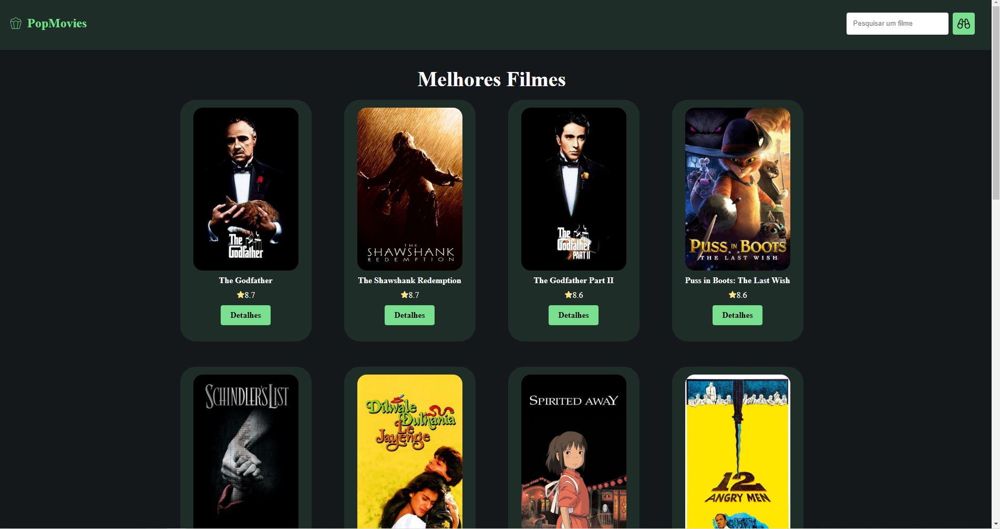
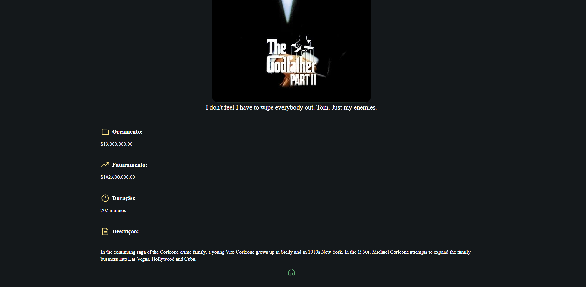
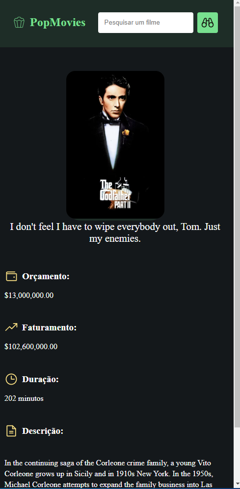

# PopMovies
Projeto com React, consumindo a API do TMDB com o uso do fetch.

### Demo

[https://pop-movies.vercel.app/](https://pop-movies.vercel.app/)

### Running it locally

`npm run dev`

### Core technologies

- React.js
- Styled Components
- Phosphoricons
- React Router

### Layout

 (public/pop-movies4.png)
